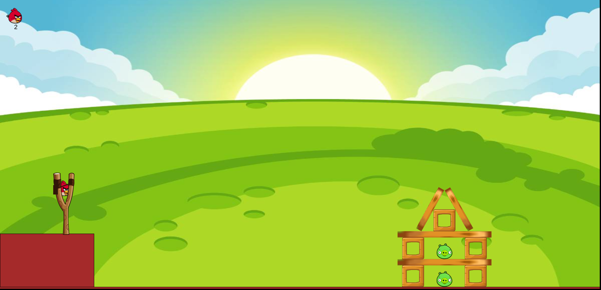

# Angry Birds Clone

Angry Birds Clone is a browser-based physics game inspired by the classic Angry Birds experience. Players use a slingshot to launch birds at wooden structures containing pigs, aiming to eliminate all targets using a limited number of birds. Every launch is influenced by real-time physics, making accuracy, timing, and strategy essential for success.

This project was built using **JavaScript**, **p5.js**, and **Matter.js** to explore concepts such as physics simulation, collision detection, object destruction, projectile mechanics, and interactive game development while recreating the feel of a popular physics-based arcade game.

---

## Preview

### Gameplay



---

## Features

* Physics-based gameplay powered by Matter.js
* Slingshot launch mechanics
* Realistic collision and object interactions
* Destructible wooden structures
* Pig elimination system
* Limited bird count for strategic gameplay
* Win and Game Over screens
* Bird reset and relaunch system
* Responsive full-screen canvas

---

## Technologies Used

* JavaScript
* p5.js
* Matter.js
* HTML5
* CSS3

---

## Getting Started

### Clone the Repository

```bash
git clone https://github.com/dslord/Angry-Birds-Clone.git
cd Angry-Birds-Clone
```

### Run the Project

Open `index.html` in your preferred web browser.

---

## Gameplay

1. Launch the game in your browser.
2. Click and drag the bird to pull back the slingshot.
3. Release the mouse button to launch the bird.
4. Destroy wooden structures and eliminate pigs.
5. Use your limited birds wisely.
6. Eliminate all pigs to win the game.
7. Lose if you run out of birds before defeating every pig.

---

## Project Structure

```text
├── assets/
│   └── Preview1.png
│
├── Game/
│   ├── BaseClass.js
│   ├── Bird.js
│   ├── Box.js
│   ├── Ground.js
│   ├── Log.js
│   ├── Pig.js
│   ├── Screen.js
│   ├── sketch.js
│   └── Slingshot.js
│
├── sprites/
│   ├── base.png
│   ├── bg.png
│   ├── bird.png
│   ├── enemy.png
│   ├── gameover.png
│   ├── ground.png
│   ├── sling1.png
│   ├── sling2.png
│   ├── sling3.png
│   ├── smoke.png
│   ├── wood1.png
│   ├── wood2.png
│   └── youwin.png
│
├── src/
│   ├── matter.js
│   ├── p5.dom.min.js
│   ├── p5.min.js
│   └── p5.sound.min.js
│
├── index.html
├── style.css
├── LICENSE
└── README.md
```

---

## Game Mechanics

| Element | Function |
|----------|----------|
| Bird | Projectile launched from the slingshot |
| Pig | Main target that must be eliminated |
| Box | Wooden structural block |
| Log | Support beam and obstacle |
| Ground | Static terrain and platform |
| Slingshot | Launch mechanism for birds |
| Win Screen | Displayed when all pigs are defeated |
| Game Over Screen | Displayed when birds run out |

---

## Controls

| Action | Input |
|---------|-------|
| Aim Bird | Click and Drag |
| Launch Bird | Release Mouse Button |

---

## Contributing

Contributions are welcome. Feel free to fork the repository, create a feature branch, and submit a pull request.

---

## License

This project is licensed under the MIT License. See the LICENSE file for details.

---

Developed by **dslord**.
